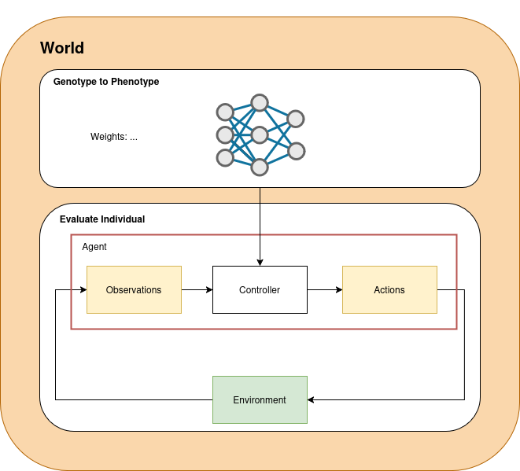

# Challenge 2: Evolving body with custom gym in MuJoCo

**Goal:** Evolve a general control strategy for different environments.
**How:** Build your own NSGA-II and train on flat and icy terrain.
---

**Introduction**  
In this challenge, we build our own multi-objective EA (called [NSGA-II](https://ieeexplore.ieee.org/stamp/stamp.jsp?arnumber=996017)), and optimise a general control strategy for different terrains. We will continue with the Ant robot and try to locomote in a flat, and icy terrain. The use of two-distinct objectives rather than one combined allows a pareto-optimisation front. Analysis of this front can reveal interesting drivers of optimality.

| Checkout out the challenge2 branch:  `git checkout challenge2` |
| :----|

*Q3.0* Understanding the World

* What are the differences between the flat and icy terrain
* Hypothesize: What would you expect when optimising either the flat or the icy terrain

| Evolve an MLP on the icy terrain |
| :----|

* Is the behaviour of the MLP very different from the previous exercise?

| Complete the NSGA-II class given in NSG.py to for multi-objective optimisation. |
| :----|

* Take into account:
  * Distance travelled in x-direction
  * Control cost of the torques squared.
* Edit the final_multi_obj_rewards output of evaluate_individual to provide two rewards. *Hint*: specific components of the reward function can be extracted from the info variable that the step() function returns.
* Compare the best controllers found between the single fitness optimisation (using the reward given by the gym environment) and multi-objective optimisation.

