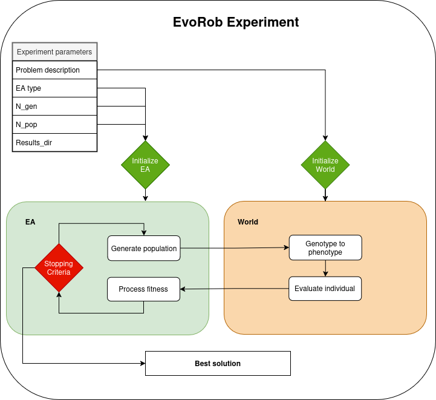

# Final report
**Goal:** Full robot evolution.  
**How:** Evolve a robot to conquer all previous environments, and a mystery terrain given at the end.

---

**Introduction**  
For the final report we are now interested in conducting an evolutionary experiment ourselves. Before just running some code, think clearly what you want to investigate. Some possible suggestions to consider:

- Different types of environments  
- Different types of tasks  
- Different geno2opheno mappings/representations  
- Different types of controllers  
- Body evolution \+ lifetime learning

For the sake of brevity, limit yourself to only one domain of comparison (e.g. different types of terrain). Hypothesize what differences you would expect in terms of body (morphological design) and brain (robot control strategies) between the different conditions.

The final grade is held in a poster session.
